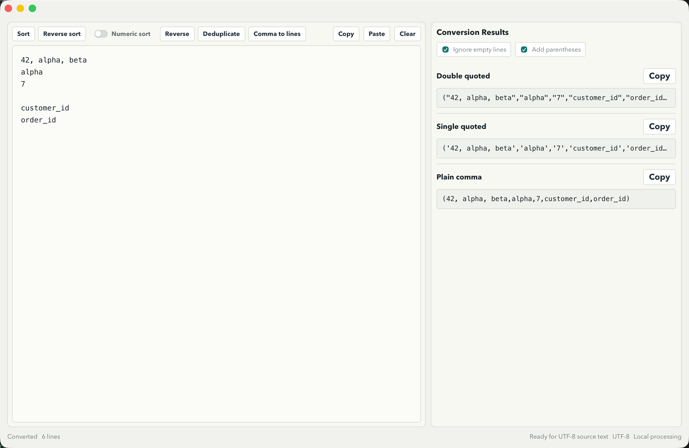

# TextTool

Language: English | [中文](README_ZH.md)

TextTool is a small macOS text utility for turning line-based source text into copy-ready comma-separated values. It is built with Tauri, Rust, and React, with the text transformation logic kept in a tested Rust core crate.



## Features

- Edit source text in a large local workspace.
- Convert lines into three output formats at the same time:
  - `"value","value"`
  - `'value','value'`
  - `value,value`
- Ignore empty lines when generating results.
- Wrap generated results with parentheses for SQL-like snippets.
- Sort lines ascending or descending, with optional numeric sorting.
- Reverse lines.
- Deduplicate lines while keeping the first occurrence.
- Convert comma-separated values back into lines.
- Find and replace with case-sensitive, whole-word, and regex options.
- Copy the source text or any generated result.
- Paste from the clipboard and clear the source text.
- Undo and redo text operations with `Command+Z` and `Command+Shift+Z`.
- Switch editor preferences such as line numbers, soft wrap, theme, result-panel visibility, and UI language.

## Shortcuts

- `Command+1`: focus the editor
- `Command+2`: show or hide the result panel
- `Command+F`: open find
- `Command+R`: open replace
- `Command+Z`: undo
- `Command+Shift+Z`: redo
- `Escape`: close find/replace, or close the settings window

## Language

TextTool supports both Chinese and English. Open the settings window and switch the `Language` option to change the UI language.

## Project Structure

```text
text-tool/
├── crates/text_core/      # Rust text-processing core and unit tests
├── frontend/              # React + Vite UI
├── src-tauri/             # Tauri shell, commands, app config
├── scripts/               # Dev and packaging helpers
└── docs/                  # README images and supporting assets
```

Important files:

- `crates/text_core/src/lib.rs`: public Rust core API and tests
- `frontend/src/App.tsx`: main UI state and workflow orchestration
- `frontend/src/services/tauriApi.ts`: frontend boundary for Tauri commands and browser fallbacks
- `src-tauri/src/commands.rs`: Tauri command wrappers
- `src-tauri/tauri.conf.json`: app and bundle configuration

## Development

Install frontend dependencies once:

```sh
npm --prefix frontend install
```

Run the Tauri desktop app in development mode:

```sh
./scripts/restart-dev.sh
```

Run the frontend only:

```sh
npm --prefix frontend run dev -- --host 127.0.0.1 --port 1420
```

## Verification

Run Rust core tests:

```sh
cargo test -p text_core
```

Build the frontend:

```sh
npm --prefix frontend run build
```

Package the macOS app:

```sh
./scripts/package-app.sh
```

The macOS bundle is written to:

```text
target/texttool-package/release/bundle/macos/TextTool.app
```

On Windows, use:

```powershell
.\scripts\package-windows.ps1
```

## Notes

- Text processing is local-first: the UI calls Tauri commands in the desktop app, and the browser dev fallback uses equivalent TypeScript implementations.
- The macOS packaging script uses `target/texttool-package` as an isolated Cargo target directory to avoid stale build metadata from other local projects.
