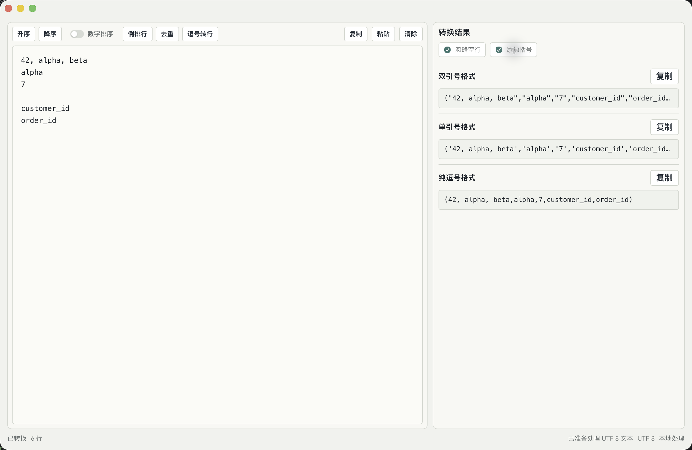

# TextTool

语言：[English](README.md) | 中文

TextTool 是一个 macOS 文本处理小工具，用来把按行输入的原始文本快速转换成可复制的逗号分隔结果。项目基于 Tauri、Rust 和 React 构建，核心文本处理逻辑放在带测试覆盖的 Rust crate 中。



## 功能

- 在左侧大编辑区输入和编辑原始文本。
- 同时生成三种结果格式：
  - `"value","value"`
  - `'value','value'`
  - `value,value`
- 生成结果时可忽略空行。
- 可为生成结果添加外层括号，适合 SQL 片段等场景。
- 支持按行升序、降序排序，并可开启数字排序。
- 支持按行倒序。
- 支持按行去重，并保留首次出现顺序。
- 支持把逗号分隔内容转换回多行文本。
- 支持查找替换，并提供区分大小写、整词匹配、正则表达式选项。
- 支持复制原始文本或任意一张结果卡片。
- 支持从剪贴板粘贴和清空原始文本。
- 支持 `Command+Z` 撤销和 `Command+Shift+Z` 重做文本操作。
- 支持切换行号、自动换行、语言、主题、结果区显示等编辑器偏好。

## 快捷键

- `Command+1`：聚焦编辑区
- `Command+2`：显示或隐藏结果区
- `Command+F`：打开查找
- `Command+R`：打开替换
- `Command+Z`：撤销
- `Command+Shift+Z`：重做
- `Escape`：关闭查找/替换，或关闭设置窗口

## 项目结构

```text
text-tool/
├── crates/text_core/      # Rust 文本处理核心和单元测试
├── frontend/              # React + Vite 前端界面
├── src-tauri/             # Tauri 桌面壳、命令和应用配置
├── scripts/               # 开发和打包脚本
└── docs/                  # README 配图和辅助资源
```

关键文件：

- `crates/text_core/src/lib.rs`：Rust core 的公开 API 和测试
- `frontend/src/App.tsx`：主界面状态和工作流编排
- `frontend/src/services/tauriApi.ts`：前端调用 Tauri 命令的边界，以及浏览器开发 fallback
- `src-tauri/src/commands.rs`：Tauri 命令封装
- `src-tauri/tauri.conf.json`：应用和打包配置

## 开发

首次安装前端依赖：

```sh
npm --prefix frontend install
```

以开发模式运行 Tauri 桌面端：

```sh
./scripts/restart-dev.sh
```

只运行前端：

```sh
npm --prefix frontend run dev -- --host 127.0.0.1 --port 1420
```

## 验证

运行 Rust core 测试：

```sh
cargo test -p text_core
```

构建前端：

```sh
npm --prefix frontend run build
```

打包 macOS 应用：

```sh
./scripts/package-app.sh
```

macOS 应用包输出位置：

```text
target/texttool-package/release/bundle/macos/TextTool.app
```

Windows 打包：

```powershell
.\scripts\package-windows.ps1
```

## 说明

- 文本处理以本地优先：桌面端 UI 调用 Tauri 命令，浏览器开发环境使用等价的 TypeScript fallback 实现。
- macOS 打包脚本使用 `target/texttool-package` 作为独立 Cargo target 目录，避免其他本地项目留下的旧构建元数据影响打包。
